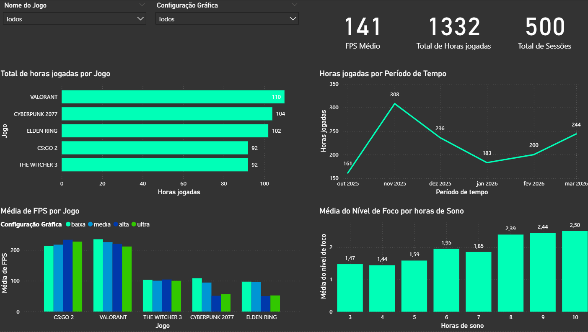

# 🎮 Gaming Performance Analytics | Engenharia e Análise de Dados

## 💡 Sobre o Projeto

Este projeto é um ecossistema completo de dados (End-to-End) que investiga a correlação entre fatores fisiológicos (sono e foco), limitações de hardware (Stutter e FPS) e o desempenho em jogos de diferentes categorias. 

O sistema abrange desde a geração inteligente de dados via script Python e persistência em banco relacional, até a análise exploratória (EDA) e visualização de alto nível.

---

## 📊 O Dashboard de Performance

*(Visuais desenvolvidos com UX/UI focado em Dark Mode. Aplicação de tratamento via Power Query e modelagem com Ordenação Customizada por Índice para categorias ordinais).*

---

## 🛠️ Arquitetura e Soluções Técnicas

### 1. Ingestão e Lógica de Dados (Python)

O grande diferencial deste projeto está no motor de geração de dados (`gerar_dados.py`). Em vez de dados puramente aleatórios, o script aplica **regras de negócio baseadas em probabilidade e lógica condicional**:
* **Gargalo de Hardware:** Jogos classificados como "pesados" (ex: *Cyberpunk 2077*) rodam com FPS reduzido e alta chance de *stuttering* em configurações gráficas "Alta/Ultra".
* **Impacto Fisiológico:** A lógica simula o comportamento humano real, onde sessões com menos de 5,5 horas de sono reduzem drasticamente o nível de foco e o desempenho percebido.

### 2. Modelagem Relacional (MySQL)

* Arquitetura de banco de dados (`database.sql`) projetada com integridade referencial.
* Relacionamento entre as tabelas `jogos` (dimensão) e `sessoes` (fato) utilizando Chaves Estrangeiras (FK) e restrições de validação (`CHECK constraints` para foco e desempenho).

### 3. Análise Exploratória e CRUD (Pandas & Matplotlib)

* Implementação de um CLI interativo (`main.py`) para gestão de sessões em tempo real.
* Módulo `analytics.py` integrado ao banco de dados para responder a perguntas de negócio diretamente via terminal, agrupando médias de FPS e identificando sessões críticas de "risco" (pouco sono + baixo foco).

---

## 💡 Insights Extraídos
1. **Gargalo de Hardware:** Jogos de mundo aberto como *Cyberpunk 2077* apresentam queda severa no FPS quando migrados da configuração "Alta" para "Ultra", indicando o limite técnico do hardware atual.
2. **Impacto Fisiológico:** A análise de regressão comprova que sessões com poucas horas de sono derrubam a média de foco e percepção de desempenho do jogador de forma consistente.
3. **Padrão de Consumo:** Novembro de 2025 foi o mês com maior pico de horas jogadas, o que pode ser correlacionado com o lançamento ou atualização de grandes títulos.

---

## ⚙️ Como Reproduzir o Projeto

1. **Banco de Dados:** Execute o script `database.sql` no seu ambiente MySQL para subir a estrutura das tabelas.
2. **Configuração:** Ajuste as credenciais no arquivo `database.py`.
3. **Ingestão:** Execute `python main.py` para popular o banco ou gerir os dados.
4. **BI:** Abra o arquivo `.pbix` e atualize a fonte de dados para visualizar o dashboard interativo.

---

## 🎯 Objetivo de Carreira

Este projeto foi desenvolvido como parte do meu portfólio pessoal para demonstrar competências em:
- **Python para Dados**
- **Manipulação de Bancos SQL**
- **BI & Storytelling com Power BI**

---

🚀 *Conecte-se comigo no [LinkedIn](https://www.linkedin.com/in/pedro-oliveira-sampaio-0b5469387)!*